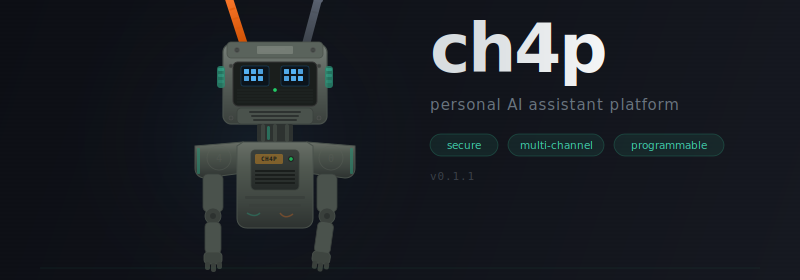

<p align="center">
  
</p>

<p align="center">
  Personal AI assistant platform. Security-first, multi-channel, programmable.
</p>

<p align="center">
  <a href="#quick-start">Quick Start</a> ·
  <a href="#how-it-works">How It Works</a> ·
  <a href="#channels">Channels</a> ·
  <a href="#security">Security</a> ·
  <a href="#features">Features</a> ·
  <a href="#documentation">Docs</a> ·
  <a href="CONTRIBUTING.md">Contributing</a>
</p>

<p align="center">
  
  
  
  <a href="https://www.npmjs.com/package/@ch4p/cli"></a>
  
</p>

---

Built on four pillars:

- **Broad connectivity** — 16 messaging channels, tunnel exposure, and a skills system with OpenClaw-compatible skill format.
- **Resilient concurrency** — OTP-style supervision trees, process isolation, backpressure, and live steering for long-running agent sessions.
- **Security-first defaults** — trait-based architecture where every defense layer is on by default, hybrid memory search, and encrypted secrets at rest.
- **Agent reliability** — mandatory tool call validation, state snapshots with diff-based verification, LLM-as-a-judge outcome assessment, and crash recovery via session notes (in-flight tasks resume after restart). Inspired by the [Agent World Model](https://arxiv.org/abs/2602.10090) research.

## Quick Start

```bash
npm install -g @ch4p/cli
ch4p onboard
ch4p agent
```

Or clone and build from source:

```bash
git clone https://github.com/ch4p-labs/ch4p.git && cd ch4p
corepack pnpm install
corepack pnpm -r build
node apps/cli/dist/index.js agent
```

> **Other ways to run:** [Docker](docs/how-to/deploy-gateway.md) · `corepack pnpm bundle` (standalone binary) · [`ch4p install`](docs/reference/cli.md) (system daemon)

## How It Works

```
Channels (CLI, Telegram, Discord, Slack, Teams, iMessage, ...)     Canvas (tldraw, A2UI)
    │                                                                     │
Gateway ─── HTTP server, session routing, cron, webhooks ─── WS bridge ───┘
    │
Agent Runtime ─── session, context, steering, worker pool
    │
Engine ─── native LLM · echo · CLI subprocess
    │
Provider ─── Anthropic · OpenAI · Google · OpenRouter · Ollama · Bedrock
```

Three modes:

| Mode | Command | Description |
|------|---------|-------------|
| **REPL** | `ch4p agent` | Interactive chat with teal-branded UI and optional `--voice` wake |
| **Gateway** | `ch4p gateway` | Multi-channel server on port 18789 |
| **Canvas** | `ch4p canvas` | Spatial browser workspace with infinite tldraw canvas |

Every subsystem is a trait interface — swap any component via config, zero code changes.

### 10 Trait Interfaces

| Interface | Purpose |
|---|---|
| `IProvider` | LLM API abstraction (stream, complete, list models) |
| `IChannel` | Messaging surface (start, stop, send, onMessage) |
| `IMemoryBackend` | Persistent memory (store, recall, forget) |
| `ITool` | Agent tool (execute, validate, abort, state snapshots) |
| `IEngine` | Execution engine (startRun, resume) |
| `ISecurityPolicy` | Security enforcement (path/command validation, audit) |
| `IObserver` | Observability (session, tool, LLM, security events) |
| `ITunnelProvider` | Public URL exposure (start, stop, getPublicUrl) |
| `IVerifier` | Task-level outcome verification (format + semantic checks) |
| `IIdentityProvider` | On-chain agent identity and reputation (plugin-ready) |

## Packages

```
packages/
  core/           # Trait interfaces, types, errors, utilities
  agent/          # Agent runtime: session, context, steering, worker pool
  providers/      # LLM providers: Anthropic, OpenAI, Google, OpenRouter, Ollama, Bedrock
  engines/        # Execution engines: native (LLM), echo (testing), subprocess (CLI wrappers)
  channels/       # 16 messaging adapters (see Channels table below)
  canvas/         # A2UI components, canvas state, WS protocol, CanvasTool, CanvasChannel
  gateway/        # HTTP server, session routing, WebSocket bridge, cron, webhooks
  tools/          # bash, file ops, grep, glob, web fetch/search, browser, memory, delegate, mesh, MCP
  memory/         # Hybrid search: SQLite FTS5 + vector embeddings
  security/       # Filesystem scope, command allowlist, secrets, I/O sanitization
  supervisor/     # OTP-style supervision trees, health monitoring
  observability/  # Console, file, multi-observer logging
  skills/         # Skill discovery, YAML frontmatter, registry (OpenClaw compatible)
  voice/          # STT (Whisper, Deepgram), TTS (ElevenLabs), always-on voice wake
  tunnels/        # Cloudflare, Tailscale, ngrok
  plugin-x402/    # x402 HTTP micropayment plugin: gateway middleware + agent tool
apps/
  cli/            # CLI entry point (standalone binary via bun compile)
  web/            # Canvas workspace: React + tldraw SPA
```

## Channels

16 messaging adapters, each implementing `IChannel`:

| Channel | Transport | Edit streaming |
|---------|-----------|---------------|
| CLI | stdio | — |
| Telegram | HTTP polling | ✓ |
| Discord | WebSocket gateway | ✓ |
| Slack | Socket Mode WS | — |
| Matrix | Long-poll sync | — |
| WhatsApp | Webhook | — |
| Signal | JSON-RPC subprocess | — |
| iMessage | sqlite3 polling + JXA | — |
| BlueBubbles | REST API + webhook | — |
| Teams | Bot Framework webhook | — |
| Google Chat | Service account webhook | ✓ |
| Zalo OA | Open API v3 webhook | — |
| Zalo Personal | REST bridge | — |
| IRC | Raw TCP/TLS | — |
| WebChat | WebSocket | ✓ |
| macOS Native | osascript dialogs | — |

## Security

Nine defense layers, all on by default:

1. **Filesystem scoping** — operations constrained to workspace root, symlink escape detection
2. **Command allowlist** — only approved commands execute, shell metacharacter injection blocked
3. **Encrypted secrets** — AES-256-GCM with PBKDF2 key derivation
4. **Output sanitization** — 25 regex patterns strip API keys, tokens, credentials from responses
5. **Input validation** — prompt injection, jailbreak, and data exfiltration detection
6. **Autonomy levels** — `readonly` / `supervised` / `full` control
7. **SSRF protection** — private IP blocking, DNS checks, cloud metadata guards
8. **Secure file permissions** — transcripts `0o600`, log dirs `0o700`
9. **Pairing token expiration** — 30-day TTL with automatic eviction

## Features

| Feature | Description |
|---------|-------------|
| **Hybrid verification** | FormatVerifier + LLMVerifier two-phase check after each task, both on by default |
| **State snapshots** | Tools capture observable state before/after execution for diff-based verification |
| **Auto-memory** | Recall relevant memories before each message, store learnings after each run |
| **Hybrid memory search** | SQLite FTS5 BM25 + cosine vector similarity, configurable blend; OpenAI → Ollama → noop provider chain with automatic fallback |
| **Crash recovery** | Session notes survive gateway restarts; agent resumes in-flight tasks from where it left off |
| **Canvas workspace** | Spatial tldraw interface with 11 A2UI component types, bidirectional interaction |
| **Skills** | Curated instruction sets loaded on-demand via progressive disclosure (OpenClaw compatible) |
| **Mesh orchestration** | Swarm-style parallel sub-agents across engines, bounded concurrency, partial failure tolerance |
| **Config-driven routing** | Named agents with own system prompt/model/tools, channel + regex dispatch rules |
| **Cron & webhooks** | Built-in 5-field cron scheduler and `POST /webhooks/:name` trigger |
| **Browser tool** | Playwright-based navigation, clicking, typing, screenshots, JS eval with SSRF protection |
| **MCP client** | Connect to any Model Context Protocol server, discover and proxy tools |
| **Voice wake** | Opt-in always-on mic with VAD, wake word filtering, STT into agent loop |
| **Worker pool** | Heavyweight tools run in pooled threads (4 workers, 60s timeout) |
| **Message chunking** | Auto-split at word boundaries per platform limits (Telegram 4096, Discord 2000, etc.) |
| **Permission forwarding** | Subprocess permission prompts surface in chat, user replies route to stdin |
| **x402 micropayments** | Server 402 enforcement + client auto-pay on Base/USDC (ERC-8004 compatible) |
| **Daemon installer** | `ch4p install` — zero-sudo systemd (Linux) or launchd (macOS), auto-restart |
| **Alternative LLMs** | Ollama, LiteLLM proxy, or CLI passthrough — [setup guide](docs/how-to/alternative-llm-setups.md) |

## Development

```bash
corepack pnpm -r build          # Build all packages
npx vitest run                   # Run all tests
corepack pnpm audit              # Check vulnerabilities
corepack pnpm --filter @ch4p/core build   # Build single package
```

- 19 packages in a pnpm monorepo (use `corepack pnpm` — pnpm is not on PATH)
- TypeScript strict mode, ES2023 target, NodeNext module resolution
- ESM-only (all imports use `.js` extension)
- Zero required external runtime dependencies for core, security, and CLI
- 86 test files, 2457 tests, 0 vulnerabilities

## Configuration

Config lives in `~/.ch4p/config.json`. The onboarding wizard (`ch4p onboard`) creates it interactively, or write it manually:

```json
{
  "agent": {
    "provider": "anthropic",
    "model": "claude-sonnet-4-6"
  },
  "providers": {
    "anthropic": {
      "apiKey": "${ANTHROPIC_API_KEY}"
    }
  },
  "autonomy": { "level": "supervised" },
  "memory": { "backend": "sqlite" }
}
```

Environment variables referenced as `${VAR_NAME}` are resolved at load time. `~/.ch4p/.env` is loaded automatically at startup.

See [Configuration Reference](docs/reference/configuration.md) for all options.

## Documentation

Full [Diataxis-style](https://diataxis.fr) docs in [`docs/`](docs/index.md):

| Category | Guides |
|----------|--------|
| **Tutorials** | [Getting Started](docs/tutorials/getting-started.md) · [First Channel](docs/tutorials/first-channel.md) |
| **How-to** | [Add Tool](docs/how-to/add-tool.md) · [Add Channel](docs/how-to/add-channel.md) · [Add Provider](docs/how-to/add-provider.md) · [Add Verifier](docs/how-to/add-verifier.md) |
| | [Security](docs/how-to/configure-security.md) · [Deploy Gateway](docs/how-to/deploy-gateway.md) · [Memory](docs/how-to/use-memory.md) · [Canvas](docs/how-to/use-canvas.md) |
| | [Web Search](docs/how-to/use-web-search.md) · [Browser](docs/how-to/use-browser.md) · [Skills](docs/how-to/use-skills.md) · [MCP](docs/how-to/use-mcp.md) |
| | [Cron & Webhooks](docs/how-to/use-cron-webhooks.md) · [Voice](docs/how-to/setup-voice.md) · [Observability](docs/how-to/use-observability.md) |
| | [Mesh](docs/how-to/use-mesh.md) · [Routing](docs/how-to/use-routing.md) · [x402](docs/how-to/use-x402.md) · [iMessage](docs/how-to/setup-imessage.md) |
| | [Alt LLM Setups](docs/how-to/alternative-llm-setups.md) · [Test Channels](docs/how-to/test-channels.md) |
| **Reference** | [Interfaces](docs/reference/interfaces.md) · [Configuration](docs/reference/configuration.md) · [CLI](docs/reference/cli.md) · [Security](docs/reference/security.md) |
| **Explanation** | [Architecture](docs/explanation/architecture.md) · [Concurrency](docs/explanation/concurrency.md) · [Security Model](docs/explanation/security-model.md) · [Memory](docs/explanation/memory.md) |

## Contributing

See [CONTRIBUTING.md](CONTRIBUTING.md) for development setup, code standards, and how to submit changes.

## Security

For vulnerability reporting, see [SECURITY.md](SECURITY.md). Do not open public issues for security concerns — use [GitHub's private reporting](https://github.com/ch4p-labs/ch4p/security/advisories/new).

## License

[Apache License 2.0](LICENSE) · [Changelog](CHANGELOG.md)
